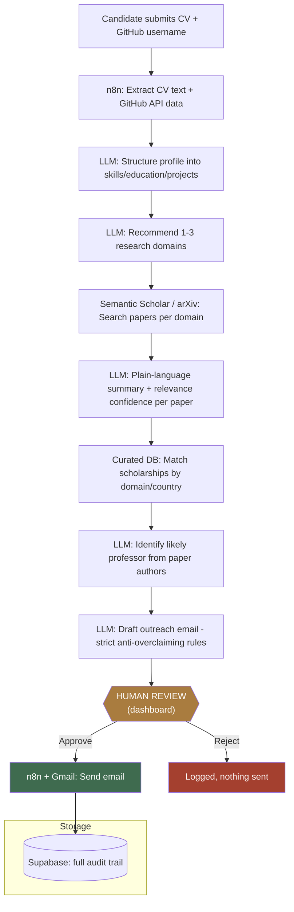

# ScholarPath — AI Booking... err, Grad School Concierge

ScholarPath takes a candidate's CV and GitHub profile and, through a multi-stage
automated pipeline with a **mandatory human review gate**, produces a recommended
research domain, relevant papers, a shortlisted professor, matching scholarships,
and a drafted (never auto-sent) outreach email — reviewed and approved by a human
before anything goes out.

This is not a fully autonomous system by design. Every stage that makes a claim
about the real world (a professor's affiliation, a paper's relevance, a
scholarship's eligibility) is required to label its own confidence rather than
assert certainty, and nothing that could affect a real person outside the system
— specifically, sending an email — happens without an explicit human click.

---

## Architecture



**Two independently-running systems, connected by a shared database:**

- **n8n** (workflow engine) does all the automated work — API calls, LLM
  prompts, data transformation — and writes results to Supabase at every step.
- **Next.js dashboard** reads from that same Supabase database and renders it.
  It doesn't talk to n8n directly for display — it's a pure read layer, plus
  one write path (the human review Approve/Reject decision), which triggers
  n8n back via a webhook to actually send the approved email.

This split matters: n8n can run entirely unattended for every phase up to
drafting the email, and the one moment a human is required is enforced by the
dashboard, not by convention.

---

## Tech Stack

| Layer | Technology | Why |
|---|---|---|
| Workflow orchestration | [n8n](https://n8n.io) (self-hosted, Docker) | Visual pipeline, built-in retry/error handling, easy to test node-by-node |
| Database | [Supabase](https://supabase.com) (Postgres) | Relational data with real foreign keys between profile → domain → paper → professor → email; Row Level Security locks every table to the service role |
| File storage | Supabase Storage | CV uploads, private bucket, never public |
| LLM | Google Gemini 2.0 Flash (or Groq, interchangeable) | Structured JSON output, generous free tier |
| Paper search | Semantic Scholar API (primary), arXiv API (fallback) | Official APIs only — no scraping, per design constraint |
| Frontend | Next.js 14 (App Router), TypeScript | Server Components fetch data server-side, keeping the Supabase service role key out of the browser entirely |
| Deployment | Vercel (dashboard) + Docker on a tunnel or VPS (n8n) | Standard split for a Next.js + self-hosted-backend setup |
| Email | Gmail API (OAuth2, via n8n's Gmail node) | Only ever called from the one workflow gated behind human approval |
| Tunnel (dev) | Cloudflare Tunnel | ngrok's free tier blocks automated webhook calls (Meta, and generally any server-to-server request) behind an interstitial page; cloudflared doesn't |

---

## How It Works — Phase by Phase

### Phase 1 — Intake & Profile Extraction
CV (PDF/DOCX) + GitHub username in. n8n extracts CV text, pulls GitHub repo/
language data via the GitHub API (with retry + graceful fallback if the
username is invalid or GitHub rate-limits), and an LLM call structures both
into a single profile object — skills, education, projects, and an
`extraction_notes` field that flags anything ambiguous or thin rather than
guessing.

### Phase 2 — Domain Recommendation + Paper Search
A second LLM call suggests 1–3 specific research domains grounded in the
structured profile (not generic "Computer Science" regardless of input). Each
domain is searched against Semantic Scholar (falling back to arXiv if empty),
and every returned paper gets an LLM-written plain-language summary plus an
honest `relevance_confidence` rating — a weak match is labeled weak, not
inflated.

### Phase 3 — Scholarship Matching
Domain + candidate country are checked against a small, **curated and dated**
scholarship table (DAAD, Chevening, Fulbright, Erasmus Mundus, seeded with
real, sourced data) — not a live API, since none exists for this. Every match
carries a confidence level and an explicit `country_eligibility_status`, which
defaults to "not verified" unless a human has actually confirmed it.

### Phase 4 — Professor Identification + Drafted Outreach + Human Review
The strongest papers' authors are checked for likely PI status (never guessing
which co-author is the supervisor without evidence). If a professor is
identified with a real contact email on file, an email is drafted under strict
rules — it can never claim the professor is "recruiting" or "has funding"
unless that was explicitly verified, never fabricates familiarity, and stays
under 200 words. This draft, plus the full context behind it, is shown on the
dashboard's review page. **Nothing sends without an explicit Approve click**,
which the dashboard blocks entirely if no contact email was ever found.

### Phase 5 — Dashboard + Deployment
The dashboard grows with each phase rather than being built once at the end —
by Phase 4 it shows profile, papers, professor, scholarships, and the email
review all in one place, plus a live-polling view for a candidate's pipeline
run in progress.

---

## Project Structure

```
scholarpath/
├── supabase/              # SQL migrations, one per phase, run in order
├── n8n/
│   ├── phase1/ .. phase4/ # workflow build guides + importable JSON exports
│   └── shared/            # cross-phase conventions (error handling, pacing)
├── prompts/                # LLM prompt templates, one file per phase
├── dashboard/               # Next.js app (or scholarpath-display/ for the
│                             # minimal read-only variant)
├── DEPLOYMENT.md
└── TESTING.md
```

---

## Design Principles This Project Holds Itself To

- **No unverified claim is presented as fact.** Every matching/identification
  stage outputs a confidence level and, where relevant, an explicit
  "not verified" flag rather than a false-confident guess.
- **No scraping.** Official APIs only (GitHub, Semantic Scholar, arXiv) —
  even where scraping would return more data.
- **Nothing external-facing happens unattended.** The email send is the one
  action with real-world consequence outside the system, and it's the one
  action that structurally cannot happen without a human decision.
- **Every external API call has retry + graceful degradation** — a GitHub
  404, a Semantic Scholar empty result, or an LLM parse failure logs and
  continues rather than silently corrupting downstream data or crashing the
  run.

---

## Current Limitations (honestly stated, not hidden)

- Professor/scholarship matching is explicitly best-effort — there is no
  reliable API for either, so this is the pipeline's structurally weakest
  stage, and its own confidence labeling reflects that.
- The curated scholarship table currently has 4 seed entries and needs an
  owner to re-verify deadlines each admissions cycle — it will go stale
  without active maintenance.
- Dev infrastructure (Docker + Cloudflare quick tunnel) is not yet
  production infrastructure — see `DEPLOYMENT.md` for the gap and options.
